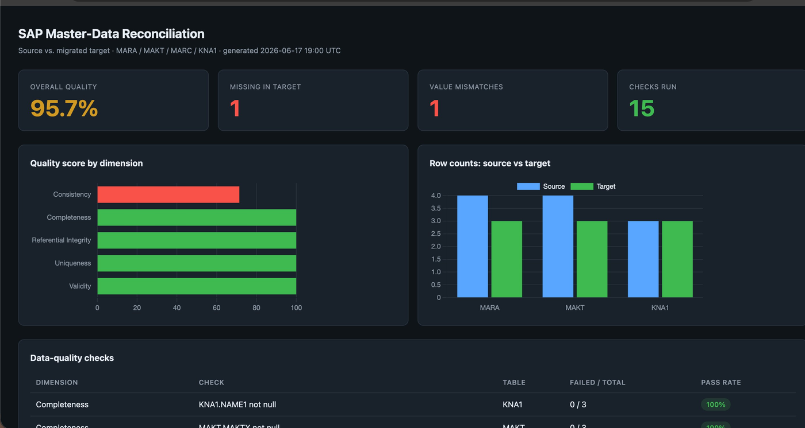

# SAP Master-Data Reconciliation

SQL-based reconciliation of SAP master data. Models the core tables
(**MARA, MAKT, MARC, KNA1**), compares a **source** extract against the
**migrated target**, flags missing records and value mismatches, scores
data quality across five dimensions, and renders an interactive dashboard —
no Power BI or Tableau install required.

Built around a real data-migration workflow: when you move master data
between systems, you need objective proof that what landed in the target
matches what left the source.

## Dashboard

`python3 run_pipeline.py` generates a standalone HTML dashboard from the SQL
results. It opens in any browser — no BI tool, no server.



The dashboard surfaces, at a glance:

- **KPI cards** — overall data-quality score, count of records missing in the
  target, count of value mismatches, and total checks run.
- **Quality score by dimension** — a horizontal bar per dimension; bars turn
  red below 90%, amber 90–99%, green at 99%+, so a failing dimension is
  obvious immediately.
- **Row counts: source vs target** — side-by-side bars per table, the quickest
  way to spot rows that never made it across.
- **Data-quality checks table** — every individual check with its failed/total
  counts and a colored pass-rate pill.
- **Missing in target** and **Value mismatches** tables — the exact offending
  records, so a defect is traceable down to the material number.

## Roadmap

- [x] **Phase 1** — SAP master-data schema (MARA, MAKT, MARC, KNA1) with keys
- [x] **Phase 2** — Sample target data loaded
- [x] **Phase 3** — Reconciliation SQL (missing records, value mismatches, row-count checks)
- [x] **Phase 4** — Data-quality scorecard (completeness, validity, uniqueness, referential integrity, consistency)
- [x] **Phase 5** — Interactive HTML dashboard over the SQL results

## Quick start

Requires Python 3 (uses the built-in `sqlite3` module — no pip installs).

```bash
python3 run_pipeline.py      # builds the DB, runs checks, writes the dashboard
open dashboard/index.html    # macOS; use xdg-open on Linux
```

This builds `recon.db` from the SQL scripts, prints a console summary, and
writes `dashboard/index.html`.

Prefer raw SQL? Run the scripts in order against SQLite:

```bash
sqlite3 recon.db < sql/01_create_tables.sql
sqlite3 recon.db < sql/02_insert_data.sql
sqlite3 recon.db < sql/03_source_tables.sql
sqlite3 recon.db < sql/04_source_data.sql
sqlite3 recon.db < sql/05_reconciliation.sql
sqlite3 recon.db < sql/06_data_quality_scorecard.sql
```

## How the scorecard works

Phase 4 lives in a single SQL view, `DQ_SCORECARD`. Every check returns one
row in a uniform shape:

```
dimension | check_name | table_name | total_records | failed_records
```

Because every check shares that shape, a pass-rate rolls up cleanly with one
expression — per check, per dimension, or overall:

```sql
ROUND(100.0 * (total_records - failed_records) / NULLIF(total_records, 0), 1)
```

`run_pipeline.py` reads the view, computes those rollups, and feeds them to the
dashboard. To add a check, append one `UNION ALL SELECT ...` block that returns
the five columns — nothing downstream needs to change.

### Data-quality dimensions

| Dimension | What it verifies |
|---|---|
| **Completeness** | Mandatory fields (MTART, MEINS, MAKTX, NAME1) are populated |
| **Validity** | Values fall in allowed domains (material type, procurement type, ISO country, positive weight) |
| **Uniqueness** | Primary keys do not duplicate |
| **Referential Integrity** | Child rows (MAKT, MARC) point to a real MARA parent |
| **Consistency** | Target agrees with source — the migration check |

## Project structure

```
sql/
  01_create_tables.sql          Target schema (MARA, MAKT, MARC, KNA1) + keys
  02_insert_data.sql            Target (migrated) sample data
  03_source_tables.sql          Staging tables for the source extract
  04_source_data.sql            Source sample data (with seeded defects)
  05_reconciliation.sql         Missing records, value mismatches, row counts
  06_data_quality_scorecard.sql DQ_SCORECARD view + rollup queries
run_pipeline.py                 Builds the DB, runs checks, emits the dashboard
dashboard/index.html            Generated interactive dashboard
docs/dashboard-preview.png      Screenshot used in this README
```

## Sample findings

The seeded sample data deliberately contains two defects so the checks have
something to catch:

- **Missing record** — `MATNR 1004` exists in source but not in the target.
- **Value mismatch** — `MATNR 1003` net weight is `8.00` in source vs `8.5` in target.

These pull the **Consistency** dimension to ~71% and the overall score to
95.7%, and they appear by name in the two defect tables on the dashboard.

## Tables modeled

| Table | Description | Key |
|---|---|---|
| MARA | Material master (general) | MATNR |
| MAKT | Material descriptions | MATNR + SPRAS |
| MARC | Material plant data | MATNR + WERKS |
| KNA1 | Customer master (general) | KUNNR |

## Notes

`recon.db` is regenerated on every run and is git-ignored. Swap the sample
INSERTs in `02`/`04` for your own extracts to reconcile real datasets. The
dashboard loads Chart.js from a CDN, so the two charts render when the page is
opened with internet access.
